# TrackBus Server

Servidor API para seguimiento de buses, paraderos, rutas y viajes.

## Diagrama de relaciones (ER)

Fuente Mermaid editable: `docs/modelos-er.mmd`

## Como leer el diagrama

1. Una RUTA tiene muchos BUS.
2. Una RUTA tiene muchos VIAJE.
3. Un BUS puede registrar muchos VIAJE.
4. Un PARADERO puede aparecer en muchos VIAJE.
5. VIAJE conecta BUS, PARADERO y RUTA en un evento con fecha de actualizacion.
